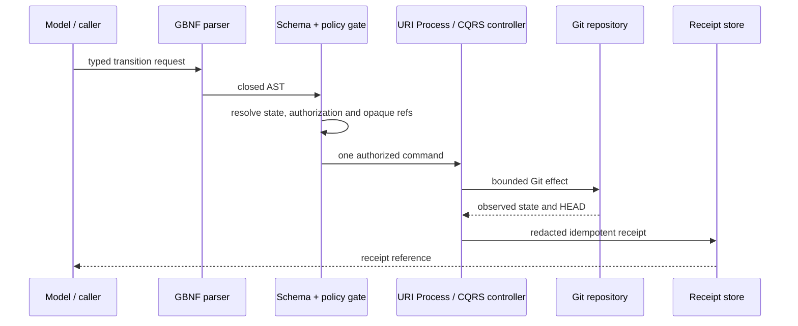

# Git lifecycle logic flow

For a new repository the first effect is `seed-baseline`. The gate requires an
unborn `HEAD`, no implementation, no remote, a published governance lock, an
exact seed-profile allowlist and a passing secret scan. The controller creates
one local commit, reads the resulting SHA and uses it as the delivery base.
Every implementation edit happens afterwards.

State mismatch, an unknown reference, repeated idempotency key with different
content, foreign dirty data or any request field outside the schema rejects
before a Git effect. Trusted merge and release evidence is resolved by protected
infrastructure; it cannot be created by a model request.
